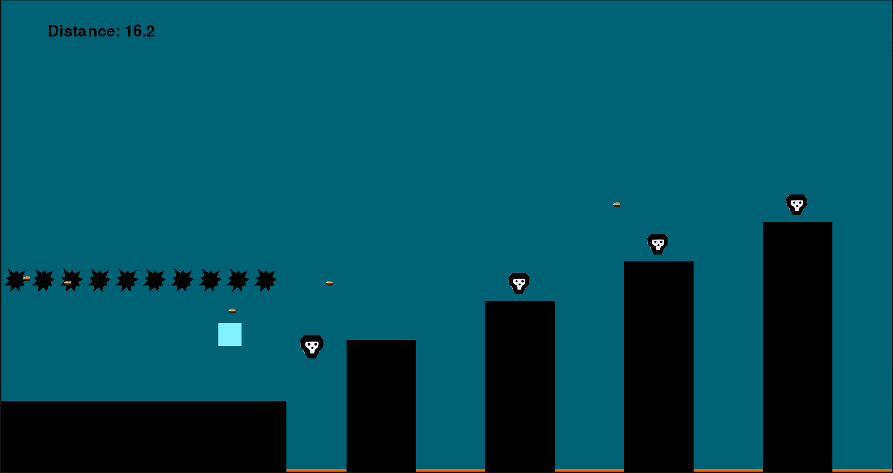

# JUMPANDRUN

A jump-and-run game using [pygame](https://github.com/pygame/pygame).

  

## Usage

Install [Python](https://www.python.org/downloads/), if you do not already have it, and run `pip install pygame`.
Clone the repository to your machine, navigate into the JUMPANDRUN folder and run `python main.py`.